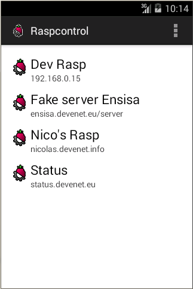
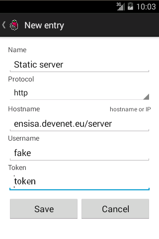

# TP-Android-Raspcontrol-2014

Android application to manage Raspcontrol (Raspberry Pi Control Centre)

***

To use the fake server, just put the folder `server` in a PHP web server.

You can also use the static api for demonstration:

Source code is available on [https://github.com/nicolabricot/TP-Android-Raspcontrol-2014](//github.com/nicolabricot/TP-Android-Raspcontrol-2014)

